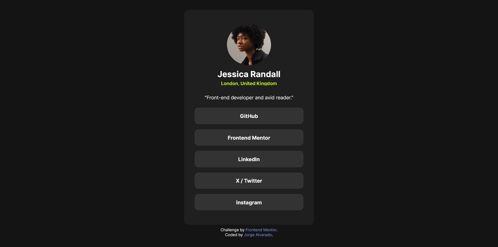
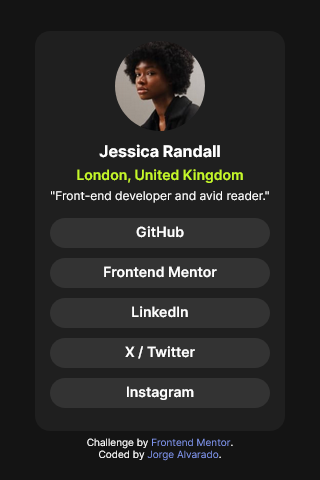

## Table of contents

- [Overview](#overview)
  - [The challenge](#the-challenge)
  - [Screenshot](#screenshot)
  - [Links](#links)
- [My process](#my-process)
  - [Built with](#built-with)
  - [What I learned](#what-i-learned)
- [Author](#author)
- [Frontend Mentor](#Frontend-Mentor)

# Overview

## The challenge

**Objective:**Build a social links profile page matching the provided designs.
**Skills:** Requires basic HTML and CSS knowledge.
**Design Widths:**
-Mobile: 480px
-Desktop: 1440px

**Color Palette:**
-Primary: Green (hsl(75, 94%, 57%))
-Neutrals: White (hsl(0, 0%, 100%)), Grey (hsl(0, 0%, 20%)), Dark Grey (hsl(0, 0%, 12%)), Off Black (hsl(0, 0%, 8%))

**Typography:**
-Body Font Size: 14px
-Font Family: Inter
-Weights: 400, 600, 700

**Tools:**
-Use any tools. focus on practicing skills or exploring new ones.

**Interactive Elements:**
-Implement hover and focus states.

### Screenshot of My Work

**Desktop Screenshot**

**Mobile Screenshot**

### Links

- Solution URL: [Github code](https://github.com/JorgeSoftwareDev/Project2_Social-links-profile)
- Live Site URL: [Netifly Live Site](https://main--transcendent-pithivier-1b1aa1.netlify.app/)

## My process

### Built with

- Semantic HTML5 markup
- CSS custom properties
- Flexbox
- Link Hover
- Link Focus
- Keyframe animations
- CSS Grid
- Mobile-first workflow

### What I learned

Didn't learn much, just practiced what I already know.

## Author

- LinkedIn - [Jorge's LinkedIn](https://www.linkedin.com/in/jorgesoftwardev/)

<!-- - Frontend Mentor - [@yourusername](https://www.frontendmentor.io/profile/yourusername) -->

## Frontend Mentor - Social links profile solution

This is a solution to the [Social links profile challenge on Frontend Mentor](https://www.frontendmentor.io/challenges/social-links-profile-UG32l9m6dQ).
